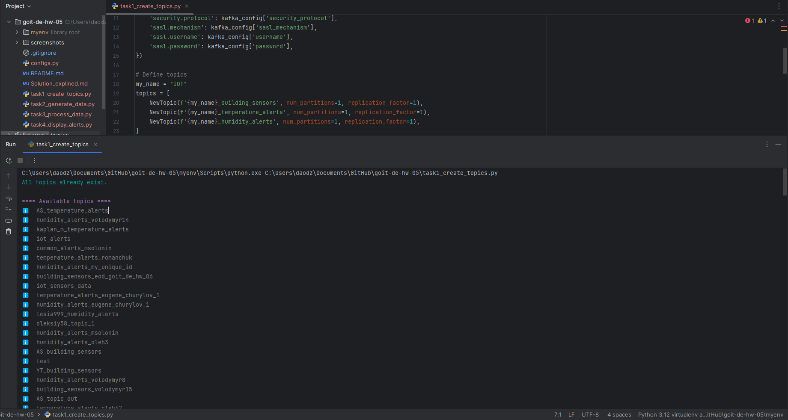
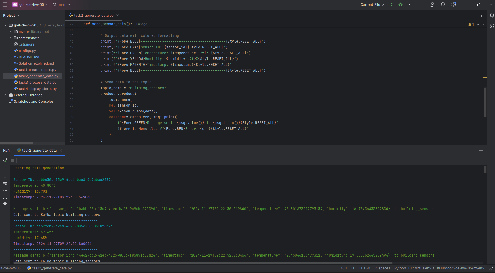
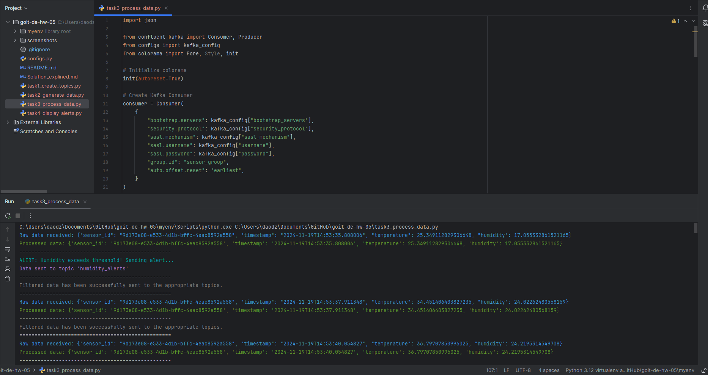
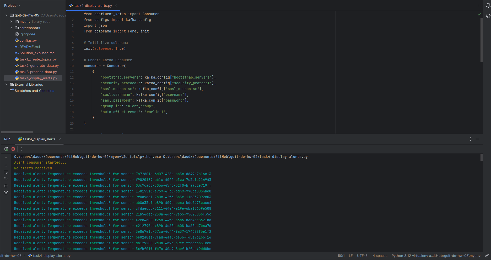

# Solution

**1. A screenshot of three topics using the command [print(topic) for topic in admin_client.list_topics() if "my_name" in topic];
The screenshot demonstrates:**

- Successful creation of unique topics for the name **_IOT_**.
- A list of all available topics on the broker.

**2. A screenshot of sensor data generation and sending data to `building_sensors`, demonstrating the simultaneous operation of two (or more) instances of the program:**

This script simulates the operation of a sensor that sends data to Kafka:

- It generates a unique `sensor_id`.
- It generates random values for temperature, humidity, and timestamp.
- It formats and displays the data in the console with color formatting.
- It sends the generated data to the Kafka topic `building_sensors`.
- It repeats the data generation and sending every 2 seconds until manually interrupted (CTRL+C).

**3. A screenshot of receiving data and filtering the specific data that will be used further, with a demonstration that the filtered data was sent to the appropriate topics.**

The screenshot demonstrates:

- Processing data from the `building_sensors` topic.
- Detecting threshold exceedances for temperature or humidity.
- Notification of sending alerts to the `temperature_alerts` and `humidity_alerts` topics.
  The script processes the received messages, generates alerts for critical values, and sends them to the corresponding topics.

**4. A screenshot of the result of recording the filtered data:**

The screenshot demonstrates:

- Display of received alerts:
  - Alerts for exceeding temperature and humidity thresholds.
  - Identification of the sensor (sensor_id).
- Between the alerts, there is a message **_"No alerts received"_** indicating that there are currently no new messages in the `temperature_alerts` and `humidity_alerts` topics.
  The script reads data from the corresponding Kafka topics (`temperature_alerts` and `humidity_alerts`) and displays the alerts in the console.

